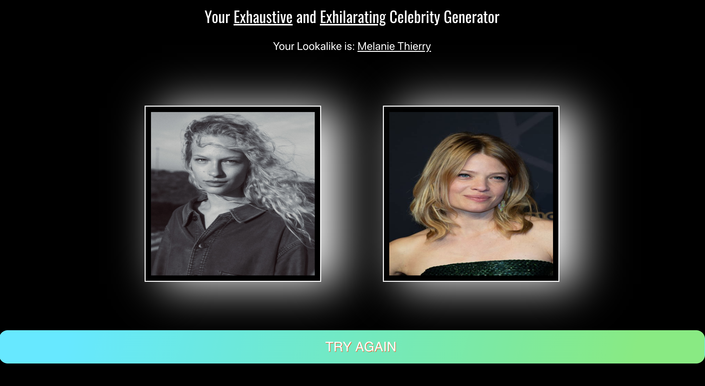

# Project 2: React Hackathon to integrate with third party API

# Brief

Consume at least one public API into a React application to create a fun or useful product. Have several components, at least one classical and one functional. Be deployed online and accessible to the public.

# Timeframe: 

36 hours

# Technologies used:

* ReactJS
* Express
* NodeJS
* Axios
* SASS
* Bulma
* HTML5
* CSS
* JavaScript

# Contributors

[George Jones](https://github.com/Jompra)

# Deployment 

This website is deployed on Netlify and can be found [here](https://your-celeb-face.netlify.app/)

# Getting Started

To run this app you will need to clone or download the files and sign up for the two APIs used: 

[Luxand Cloud](https://rapidapi.com/aboykov/api/luxand-cloud-face-recognition?endpoint=apiendpoint_188c3cc8-6f87-4558-a9c7-be772a5a7ccf) 

[Microsoft Azure](https://azure.microsoft.com/en-gb/free/search/?&ef_id=CjwKCAjw2a32BRBXEiwAUcugiISGAMerV2gAqqtH0Va-SKRbGl6PQg7R1nJVHepxe0Jw54XQ_vvbPRoCFH4QAvD_BwE:G:s&OCID=AID2000125_SEM_CjwKCAjw2a32BRBXEiwAUcugiISGAMerV2gAqqtH0Va-SKRbGl6PQg7R1nJVHepxe0Jw54XQ_vvbPRoCFH4QAvD_BwE:G:s&dclid=CjkKEQjw2a32BRCwkfevsaHM07IBEiQAOHSxZRMAtT9DP8wOMrB3t3Ey1nc54XpMnbMwqVuQT1vdQjnw_wcB)


 Add the keys to a `.env` file, making sure they look like the below example

```
REACT_APP_AZURE_KEY = Azure API Key
REACT_APP_RAPID_KEY = Rapid API Key
```

Then run 

`$ npm i `

or

`$ yarn install `

to start 


# Project 

This fun, quick and easy to use website is made up of a homepage and a results page.  As a pair we wanted to build something that could be enjoyed by everyone. Our final product was a celebrity generator where users can upload an image URL of themselves and see who their celebrity lookalike is. 

# Build 

With only a day and a half and such a creative brief our biggest challenge was discovering and agreeing on a third party API to use. We were very excited to discover the Luxand Cloud Face Recognition API as it had a lot of potential use cases that were not immediately obvious and we felt this was something we could use to create something quite unique. 

A quick wireframe and walkthrough of the app was next and then we went straight into the build. I set up the different components for the app and designed the look and feel of the site whilst my partner focused on the documentation and set up required for integration. 

Once fully integrated we then worked together smoothing out small bugs. For example, we had a problem in the results component with the celebrity lookalike image being generated a lot faster than the celebrity name. We wanted both to appear insync so implemented a setInterval work around that created the illusion of shuffling through other potential celebrities in the database before landing on the celeb lookalike. 

# Screenshot walk through 

The homepage where users can upload a URL image into the generator bar.


The results page displays the user’s image plus their celebrity lookalike’s name and image.





# Wins and Blockers 

I was really happy with our idea to use the Luxand Cloud Celebrity Recognition API. It was originally designed for journalists to pick out celebritry names from crowds of celebrities in photographs. 

A real win was deciding to integrate with the Microsoft Azure Cloud Bing Image Search API. We felt it was better for the user experience to see the celebrity image as well as a name and Bing was by far the most reliable API when searching less well known celebrities as a search term. 


This was my first project pair coding and I really enjoyed working with someone else as part of a team. We both brought different strengths to the project and I learnt a lot in a short amount of time. Our communication was clear which meant we were able to build a really effective and successful web app that was in-line with the original brief. 


I am really happy with our shuffle card feature in the results page. Designed to add a bit of suspense to the user experience, we created a loading effect that I think worked nicely. 


```
  shufflePictures = () => { 
    let i = 0
    const shuffle = setInterval(() => {
      /if/ (*this*.state.lookalike){
        clearInterval(shuffle)
        /return/
      } 
      *this*.setState({ celebImage: *this*.state.stockImages[i] })
      /if/ (i === *this*.state.stockImages.length - 1){
        i = 0
      } /else/ {
        i++
      }
    }, 300)
  }
```

# Key Learnings

I believe we were able to create a successful app in such a small amount of time due to our simple design structure. We were strict with each other to not create a project that could get away from us. This calm and structured approach helped us achieve MVP within the 36 hour deadline and allowed time for styling. 

This was my first project using Bulma and was a really enjoyable framework to work with. It was quick to understand and implement and created something eye catching and attention grabbing quickly. 

# Bugs 

I would like to focus on the shuffle card functionality some more as it is a bit jumpy and image quality could be improved. 


# Future Features 

With more time I would have liked to give users the ability to upload an image of themselves instead of a URL. 
I would also like to the make the design responsive.  


